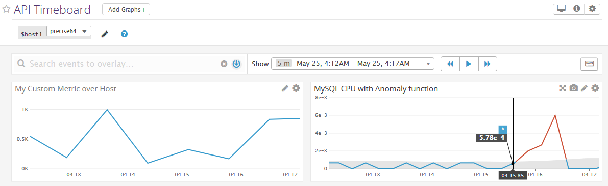

Here are the answers to the Tech Writer challenge for the Datadog job application. 
This was a hard-won challenge that lead to a valuable learning experience. 
The task purposed was a compelling approach to demonstrate both writing 
skills and technical expertise.

The detailed, easy-to-follow documentation found on the Datadog website, 
combined with prior experience in related areas, were essential to 
completing the varied tasks presented in the challenge.

## Prerequisites - Setting up the environment

The local machine used in this excercise is Windows 10 64-bit.

1. Installing Vagrant

The virtual environment manager Vagrant was installed following instructions for setting up 
[Vagrant with Ubuntu 12.04 VM](https://github.com/jeremy-lq/hiring-engineers/blob/tech-writer/README.md#vagrant),

Note: this particular Linux version, being LTS (long term support),
has proven somewhat outdated for the purposes of installing
other products and libraries (See [troubleshooting](blog/blog.md#troubleshooting) in our blog entry). 
Unfortunately, this was realized in the middle of the exercise. So rather than changing course, a workaround was decided. 
For a stable and long-term testing environment, a later version of the Linux setup should be used.

The folder for the installed at `C:\VM\Vagrant`

2. Intalling VirtualBox

The VM manager software VirtualBox was installed
following instructions at [Download VirtualBox](https://www.virtualbox.org/wiki/Downloads).

3. Rebooting was required to apply changes from previous installations.

4. Spin-up default VM

First we created an instance of our VM using the Vagrant template `hashicorp/precise64`, which is Ubuntu 64 12.X LTS.
```
    > md c:\VM\test
    > cd c:\VM\test
    > vagrant init 
```

Observing the allocated resources in the VirtualBox Manager,
in order to prevent slow down or other performance issues affecting our tests,
the memory was increased in `c:\VM\test\Vagrantfile`:
```
      config.vm.provider "virtualbox" do |vb|
        vb.memory = "2048"   # Mb was "398"
      end
```
Next we start and connect to the shell of our VM:
```
    > vagrant up

    > vargant ssh
```
Note: The default username `vagrant / vagrant` is used by SSH session,
and no password is required, since the authentication is performed
using the locally stored encrypted key.

5. Linux environment update

Before proceeding, we update the command-line installation management
for the Linux environment and make sure we have the necessary tools,
such as `curl`.

```
    $ sudo apt-get update
    $ sudo apt-get install curl
```

### Installing Datadog

We follow the instructions for installing the Datagod Agent on Ubuntu environment
at [Installing on Ubuntu](https://app.datadoghq.com/account/settings#agent/ubuntu):

```
    $ export DD_API_KEY=baa4d41e9cbdd3ffc335a6acc3476071 
    $ bash -c "$(curl -L https://raw.githubusercontent.com/Datadog/datadog-agent/master/cmd/agent/install_script.sh)"
```
Upon successful installation, we note the console output:
```
    ...
        * Adding your API key to the Agent configuration: /etc/datadog-agent/datadog.yaml

        * Starting the Agent...

        datadog-agent start/running, process 2262

        Your Agent is running and functioning properly. It will continue to run in the
        background and submit metrics to Datadog.

        If you ever want to stop the Agent, run:

            sudo stop datadog-agent

        And to run it again run:

            sudo start datadog-agent
```
The after stopping the agent, we verify a successful start again:
```
    $ sudo start datadog-agent
    datadog-agent start/running, process 3023

    $ pstree -a | less
      ...
      |-agent start -p /opt/datadog-agent/run/agent.pid
      |   `-9*[{agent}]
      |-trace-agent --config /etc/datadog-agent/datadog.yaml --pid /opt/datadog-agent/run/trace-agent.pid
      |   `-6*[{trace-agent}]

    $ ps axu | less
    dd-agent  3023  0.7  9.8 688732 36812 ?        Ssl  01:27   0:01 
        /opt/datadog-agent/bin/agent/agent start -p /opt/datadog-agent/run/agent.pid
    dd-agent  3025  0.0  1.7 340704  6480 ?        Ssl  01:27   0:00 
        /opt/datadog-agent/embedded/bin/trace-agent --config /etc/datadog-agent/datadog.yaml --pid /opt/datadog-agent/run/trace-agent.pid
```

We also note the location of the logs if there are errors and for future reference:
```
    /var/log/datadog/agent.log
```

### Restarting the Agent

Restarting is necessary when when editing the main configuration file and that of the Agent:

 * `/etc/datadog-agent/datadog.yaml`
 * `/etc/datadog-agent/conf.d/mysql.d/conf.yaml`
 * etc

To perform a restart,
```
    $ sudo service datadog-agent restart
        ... process 16581
```

For more details, see [Agent commands](https://docs.datadoghq.com/agent/faq/agent-commands/).

## Collecting Metrics

Reference locations:

 - Log file: `~/ddagent-install.log`
 - Config file: `/etc/datadog-agent/datadog.yaml`


### Show Custom Tags on the Host Map page

1. Add tags in the Agent config file 

Edit configuration file:
```
    $ sudo vi /etc/datadog-agent/datadog.yaml
```
Provide `tags` section:
```
    tags:
      - my_user:the_write_one
      - my_project:hiring
      - my_role:tech_writer
```

2. Restart Agent (see [above](#restart-agent))

3. Show Host and its tags on the Host Map page in Datadog


### Install a Datadog integration with a local database

1. Install MySQL
```
    $ sudo apt-get update
    $ sudo apt-get install mysql-server
        root user: no passowrd
```
Note: mysql_secure_installation is not executed for the purposes of this excercise.

2. Sample MySQL database

We are using instructions under [Connecting to the MySQL Server with the mysql Client](https://dev.mysql.com/doc/mysql-getting-started/en/#mysql-getting-started-connecting).

The following commands were used to establish a sample instance and execute typical session:
```
    $ mysql -u root
    > create database pets;
    > show databases;
    > use pets
    > CREATE TABLE cats ...
    > show tables;
    > DESCRIBE cats;
    > INSERT INTO cats ...
    > SELECT * FROM cats;
    > SELECT * FROM cats WHERE name LIKE '%ie';
    > SHOW CREATE TABLE cats\G
```

3. Install Datadog Agent in MySQL

Using instructions under [MySQL integration](https://app.datadoghq.com/account/settings#integrations/mysql)

Configure the Agent to connect to MySQL
```
    $ sudo cp /etc/datadog-agent/conf.d/mysql.d/conf.yaml.example /etc/datadog-agent/conf.d/mysql.d/conf.yaml
    $ sudo vi /etc/datadog-agent/conf.d/mysql.d/conf.yaml
```
conf.yaml:
```
        init_config:

        instances:
          - server: localhost
            user: datadog
            pass: dqKvIf[Hua18lWKZo2qHdQ9F
            tags:                  # Optional
              - optional_tag1
              - optional_tag2
            options:               # Optional
              replication: false
              galera_cluster: 1
```

Restart Agent (see [above](#restart-agent))

4. Sample MySQL sessions

Make more connections from the Linux shell using:
```
    $ mysql -u root
```

Execute sample session to generate metrics:
```
show databases;
use pets;
show tables;
select * from cats;
```

5. Show database metrics


### Custom Agent check that submits a specifc random metric

1. Create Python code for the Agent check

`/etc/datadog-agent/checks.d/my_check.py`:
```
        from checks import AgentCheck

        from random import randint

        class MyCheck(AgentCheck):
            def check(self, instance):
                self.gauge('my_metric', randint(0, 1000))
```
2. Create check configuration file:

`/etc/datadog-agent/conf.d/my_check.yaml`:
```
        init_config:

        instances:
            [{}]
```

3. Restart Agent (see [above](#restart-agent))

4. Verify the custom check:
```
    $ sudo datadog-agent check my_check

        === Series ===
        {
          "series": [
            {
              "metric": "my_metric",
              "points": [
                [
                  1527227580,
                  647
                ]
              ],
              "tags": null,
              "host": "precise64",
              "type": "gauge",
              "interval": 0,
              "source_type_name": "System"
            }
          ]
        }
        =========
        Collector
        =========

          Running Checks
          ==============
            my_check
            --------
              Total Runs: 1
              Metrics: 1, Total Metrics: 1
              Events: 0, Total Events: 0
              Service Checks: 0, Total Service Checks: 0
              Average Execution Time : 0ms
```

The resulting metric is available in Metrics UI


and in Hosts view:


5. Change your check's collection interval so that it only submits the metric once every 45 seconds.

**Bonus Question:** Can you change the collection interval without modifying the Python check file you created?

`/etc/datadog-agent/conf.d/my_check.yaml`:
```
        init_config:

        instances:
            - min_collection_interval: 45
```

5. Restart Agent (see [above](#restart-agent))

6. Show Dashboard with time change from 15 seconds to 45 seconds.


## Visualizing Data

### Utilize the Datadog API to create a Timeboard

Get API_KEY and APP_KEY using [Integrations / API Keys](https://app.datadoghq.com/account/settings#api)

1. Install Datadog API on local machine:
```
    > pip install datadog
```

2. Create python shell script:

   View: [create_timeboard.py](create_timeboard.py)

3. Capture snapshot in Dashboard UI



The snapshot is captured in the Dashboard tile using the "camera" icon.
The target user is indicated with `@` notation, which promts with available email address.

The resulting snapshot can be found in the Events UI:


**Bonus Question:** What is the Anomaly graph displaying?

Anomaly function applied to timeseries graph displays a additional shaded area,
which represents "normal" range of behavior over a certain near past period of time.

The specific normal behavior depends on the selected mode. For example, in our case
it is "Basic", which tracks simple rolling quantile range (e.g. 5% - 95%).

It does not take into account non-linear shifts or periodic seasonal trends.
The Bounds parameter determines how narrow (small values near 1) or wide (values near 6)
the normal area is; the wider the area, the fewer anomalies it will determine.

## Final Question:

The Datadog community has written a substantial number of high quality integrations and libraries. Select one from [this page](https://docs.datadoghq.com/developers/libraries/). With this selection in mind, write a blog post that announces your selection and explains the benefits it offers our users/community. The post should cover installation, configuration, usage, and best practices along with code samples where applicable. You should also thank the contributor for their effort.

For the blog post to answer this challenge, please see our article [Managing Errors at Saturation Point in Node.js Using DogStatsD and Hot-Shot Client](blog/blog.md).
