# Managing Errors at Saturation Point in Node.js Using DogStatsD and Hot-Shot Client

If you’re here it’s because your looking for the secret sauce to improve reliability of your web based product. You can follow along without the pre-requisites but it will not make as much sense unless you have all the components. As with any programming language, platform, or tool that doesn’t come bundled, getting up and running takes an initial setup. Node.js has a far better installation experience than most tools or platforms; just run the installer and you’re good to go.

The Hot-shots library is used as a use case here because it integrates well with Node.js and the statics collection methods. We’re choosing something other than Python because we wanted to show another library provided by Datadog community, which might not be as well-know to wider solution providers audience.

## Pre-Requisites

For this example we are using Vagrant [hashicorp/precise64](https://github.com/jeremy-lq/hiring-engineers/blob/tech-writer/README.md#vagrant) template.

### Installing Node.js

Following [Installing Node.js via package manager - Debian and Ubuntu based Linux distributions](https://nodejs.org/en/download/package-manager/#debian-and-ubuntu-based-linux-distributions).

NOTE: Since we are using Ubuntu Precise, 
we will read about 
[running Node.js >= 6.x on older distros](https://github.com/nodesource/distributions/blob/master/OLDER_DISTROS.md).

First ensure curl and certificates are up-to-date.
This may help prevent SSL transport issues.
```shell
    $ sudo apt-get update
    $ sudo apt-get -y install curl apt-transport-https ca-certificates
```
Install Clang
```
    $ sudo apt-get install -y clang-3.4
```
Install Node.js
```
    $ curl -sL https://deb.nodesource.com/setup_8.x | sudo -E bash -
```

Note: if there are issue installing Node.js or later packages, see [Troubleshooting][#troubleshooting] below.

Test with [hello.js](hello.js).

Forward VM ports to host in the `Vagrantfile` configuration
```
    config.vm.network "forwarded_port", guest: 8081, host: 8081, host_ip: "127.0.0.1"
```
### Configure DogStatsD

Follow [DogStatsD documentation](https://docs.datadoghq.com/developers/dogstatsd/).

Enable and configure DogStatsD in `datadog.yaml`

```
    use_dogstatsd: yes
    ...
    dogstatsd_port: 8125
```

Restart Agent.

### Test a Custom Metric

Using command line.
```
    $ echo -n "custom_metric:20|g|#shell" >/dev/udp/localhost/8125
```

Note: this is similar to using Datadog agent API, as in Python,
except, here we are sending a message directly to a local UDP server.
 
This approach of sending to a UDP server is used by many community
client libraries.

Let's now verify the custom metrics were delivered in Datadog UI:

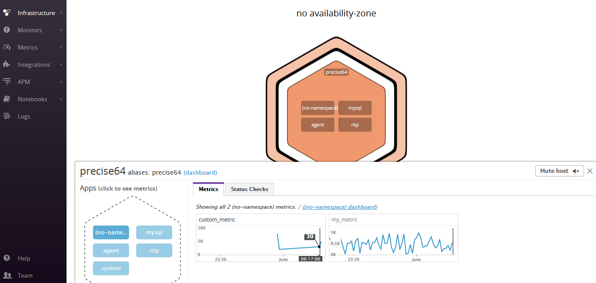

### Troubleshooting

On older Ubuntu distributions (precise), the versions of node and npm are outdated:
npm v1.1.4 and node v0.6.12.
This may cause conflicts with npm registry, e.g. getting an error "failed to fetch from registry".

To use `nvm` we follow instruction to [Install Node and npm to an Ubuntu box](http://clubmate.fi/install-node-and-npm-to-a-ubuntu-box/).

This will install the more recent versions of node (v0.11.14) and npm (2.0.0).

However, for more recent node versions, e.g. v10.3.0 (npm v6.1.0),
see details for [Node Version Manager](https://github.com/creationix/nvm).

If after reboot or new terminal session, the old version of node and npm is default, use
```
nvm ls
nvm use v10.3.0
nvm alias default v10.3.0   # for future
```

## Libraries for Metrics Collection

### Agent Client

The Agent client libraries typically do not measure statistics,
they are tasked to communicate the collected statistics to the Agent.

We use sevaral criteria for the Agent client library
- Integration with Node.js
- Providing familiar standard interface such as StatsD to facilicate adoption and adapting of existing code base, as opposed to any custom API
- API features, which provide rich reporting functionality (gauges, timing, counters) as well as flexible configuration, e.g. by setting common parameters, such as tags or prefixes from all communications.

A perfect choice to satisfy these criteria is the `hot-shots` library, which is a fork of `node-statsd` providing familiar API, with enhancements for DofStatsD features.

### Server Statistics

For web Server stats (requests per second, request time, number of errors etc) we considered the following approaches in addition to Node.js built-in functionality
 - [request](https://github.com/request/request) module
 - [request-stats](https://github.com/watson/request-stats) package 
and chose to go along with `request-stats`, as the most flexible and straight-forward approach in terms of integration (call-back interface) and API (granulated structures for metrics).

Note: to see how to collect stats for requests originated in Node.js itself,
follow [Understanding & Measuring HTTP Timings with Node.js](https://blog.risingstack.com/measuring-http-timings-node-js/)


### Install hot-shots

https://www.npmjs.com/package/hot-shots
https://github.com/brightcove/hot-shots

```
$ npm install hot-shots
```

Test in command line:
```
$ node
```
Initialize Agent client:
```
var StatsD = require('hot-shots')
client = new StatsD()
```

Generate stats:
```
client.gauge('my_gauge', 123.45)
client.event('my_title', 'description')
client.increment('my_counter')
```

Verify the custom metrics in Datadog UI

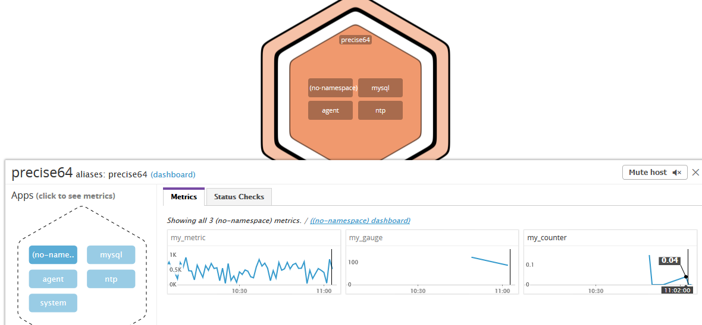

And custom Event in the Events dashboard:

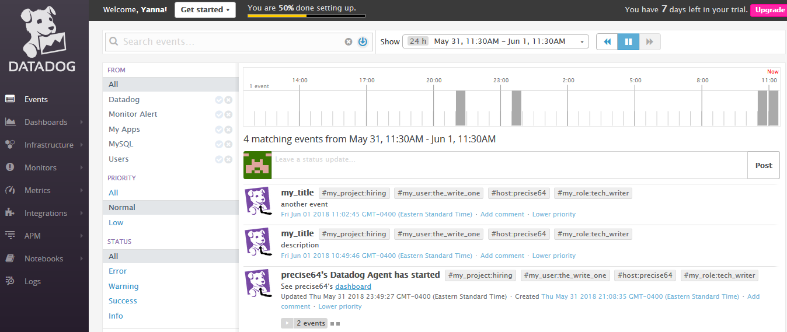

## Sample Node.js Web Application

Although a small model application is used here for demonstration purposes,
in real production environments, it makes sense to have such a small model 
application with configurable processing and resource consumption parameters.
This would allow dry-running the environment to verify the instrumentation
infrastructure and veify the correct topology assumptions.

Below we will look into some details. Complete source of the Node.js sample app is
availalbe here:
 * View source: [stats_hot.js](stats_hot.js)

To model real life behavior, we will use a random complexity parameter _(n)_,
which will determine the size and time of the response.

For the puposes of this demo, our sample application will generate
random text whose size is proportionate to the response complexity, i.e. _O(n)_.
The time will be defined as _square_ of the complexity parameter, _O(n<sup>2</sup>)_.

Here's the section of code, responsible for generating the output
and determining the size and time based on random complexity.

```javascript
function rnd(n, m) {  // inclusive
    return n + Math.floor(Math.random() * (m - n + 1)); 
}
function strFill(n, a) {
    return Array(n + 1).join(a || " "); 
}
function rndWord(n, m) {
    return strFill(rnd(n, m)).replace(/ /g, x => String.fromCharCode(rnd(0, 25) + 65 + 32)); 
}
function rndLine(n, m, nw, mw) {
    return strFill(rnd(n, m)).replace(/ /g, x => rndWord(nw, mw) + " "); 
}
function rndText(n, m, nl, ml, nw, mw) { 
    return strFill(rnd(n, m)).replace(/ /g, x => rndLine(nl, ml, nw, mw) + "\n"); 
}

var server = http.createServer(function (request, response) {

   var r = Math.random() * 10;   // random complexity 0..10
   var n = Math.floor(4*r) + 1;  // data size 1..40
   var t = Math.floor(r*r) + 10; // time      10..109
   var text = rndText(3, 10+n, 8, 12, 2, 8)
```

The sample output of the web page looks like
```
Hello Stats
from port 8081 taking 92 ms for data size 37

isl amo uorat pne yg bogfd lejnb wivipt yxazz oxu 
spjespq ea en xnjkiyxd fwlwxzx ah zknkea qyxym urhnl pc 
gpfmba emzygkdz updfipp vywae sabh vmyqudrc njfwsi asaarug uuq 
qirggewk bpv azgshrtr mkkzr wsgnc uxozsx fxrqck ddxxa xyb 
bgndxrp jynxdm zis fqinvb chq ythkyyd ka fcrk zjqhmzol cufnuvu uiaixez imhbxa 
wrfmsaz lugrha aywob qvq yku zju ouk nyhy dfaig wqmwalp hpwa 
tfu zg tbzktv ktt sn us nae ecalkko zlmcvfld tffsqxb rmugppir 
ku cl eevcmiwe nqzoycc px trdaikt xfbitfox jxs hv lviy 
bfmco tjfqq prnwwux whb ffskr ysmwpcux ljl ububavdc lh gkzsyqv whnvidei zit 
bb fls anl ms aaocy mtfmqwmg ykgwma vblwtl nnmj yeq ixkiroqq 
```

## Load Testing

The command-line tool `loadtest` allows you to configure and tweak requests to simulate real world loads.
It runs a load test on the selected HTTP or WebSockets URL. The API allows for easy integration in your own tests.

To install loadtest, See the [details](https://www.npmjs.com/package/loadtest) at the npm repository.

```
npm install -g loadtest
```

Verify a simple test
```
$ loadtest -n 200 -c 10 --rps 20 http://127.0.0.1:8081/
```
See [loadtest_test.txt](loadtest_test.txt) for sample output.

Note: to warm up Node.js server, the load should be increased gradually.
The above parameters is a good starting point.

Lower load rate (before saturation)
```
$ loadtest -n 2000 -c 200 --rps 500 http://127.0.0.1:8081/
```
Higher load rate (after saturation)
```
$ loadtest -n 4000 -c 500 --rps 1000 http://127.0.0.1:8081/
```

After increasing the load on the test web page, we can observe
increased resource consumption in the Datadog System Dashboard.
In particular, System Load, CPU Usage and System Memory show
visible increase.

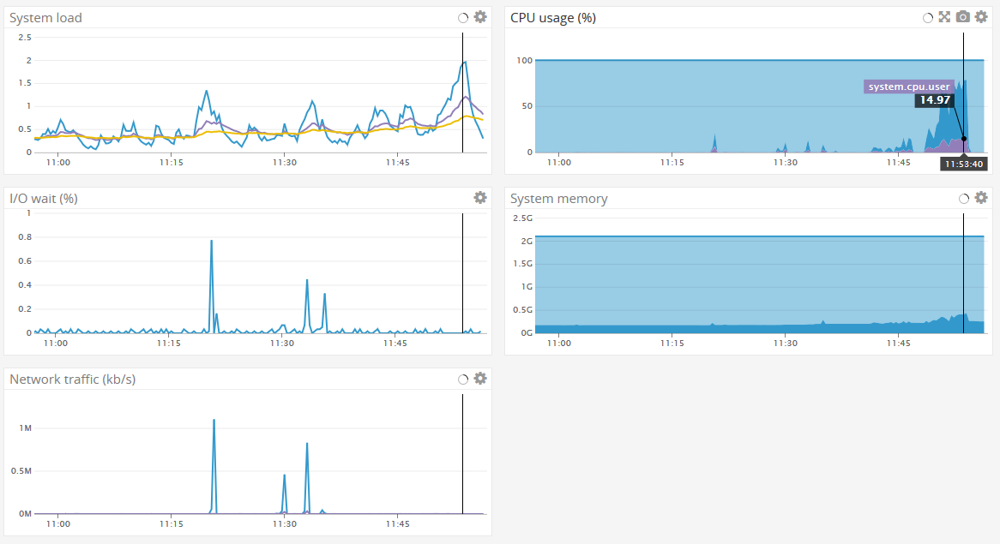

We should exect that after further increase of the load, the server
performance would suffer, and errors will start to appear.
However, to get more specific insight into performance of individual
requests, such as reposne time and error counts, we need to capture
request procecing statistics.

Note: there are several ways to capture web request processing performance,
such as in transport layer, etc. However, here we'll be capturing
statistics from inside the Node.js code itself. So we can configure
the complexity of responses (time and size in particular), and error
triggering mechanism.

## Collecting Node.js Stats

Installing `request-stats`
```
npm install request-stats --save
```

Test using a simple web app and console output.

The statistics captured by `request-stats` are represented in nested JSON structures.

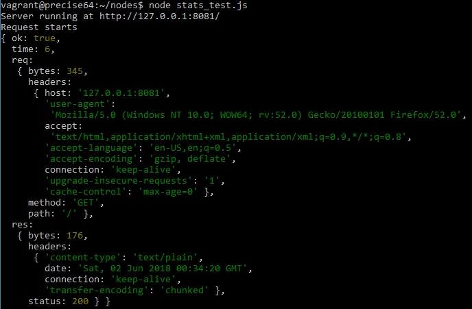

The statistics we are interested in are:
 * response size
 * response time
 * error count

In our code, the statistics will be captured as follows:
```javascript
var requestStats = require('request-stats')
    requestStats(server, function (stats) {
        // called every time request completes

        report(stats);
        // if (!stats.ok) console.log(stats);
    })

var count = 1;
function report(s) {
    console.log(sprintf(
            '%4d %4s %3s  %4d %6s %6d %6s',
            ++count, s.time, s.ok?'OK':'ERR', s.req.bytes, s.req.method, s.res.bytes, s.res.status));

    statsD.gauge('reponse.size', s.res.bytes);
    statsD.timing('response.time', s.time);
}
```

which results in tabular console output:

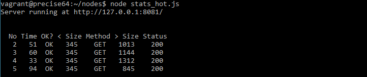


## Integrating with DogStatsD Using hot-shots

Thanks to the design insight on the `hot-shots` library,
the API is familiar to StatsD and Datadog community.
So integration is easy and intuitive.

We will be using the following Datadog metrics:
 * counter: request.count
 * counter: error.count
 * timing:  response.time
 * gauge:   reponse.size
 * tag: load_rate: 'low' | 'high'

First we instanciate the `DogStatsD` client with optional common parameters
```javascript
var StatsD = require('hot-shots'),
    statsD = new StatsD({
        prefix: 'my_node.',
        globalTags: { node_js: '', load_rate: 'low' }
    });
```

We integrate capturing response size with `request-stats` reporting mechanism
```javascript
function report(s) {
    ...
    statsD.gauge('reponse.size', s.res.bytes);
    statsD.timing('response.time', s.time);
}
```

Finally, we will be capturing error count for every situation when the
ratio of the allocated and actual processing time exceed a certain threashold:
```javascript
    var start = Date.now()
    setTimeout(function() {
        var actual = Date.now() - start;
        var r = t / actual;
        if (r < 0.10) {  // threashold: 0.10 automated load testing, 0.50 manual browser testing
            console.error(`Respose for ${t} ms takes ${actual} ms ratio ${(r*100).toFixed(2)}%`);
            statsD.increment('error.count');
        ...
    }, t);  //  t is the allocated processing time
```

## Visualizing Saturation Point with Datadog Dashboard Metrics

Applying the same load testing as shown (earlier)[#load-testing],
we determine the saturation point as such when errors first start to appear.

Then we excute the pre- and post- saturation load tests with different
metrics tags, which will help in visualization:

 * Lower load rate (before saturation), with tag: `load_rate: low`
   ```
   $ loadtest -n 2000 -c 200 --rps 500 http://127.0.0.1:8081/
   ```

 * Higher load rate (after saturation), with tag: `load_rate: high`
   ```
   loadtest -n 2000 -c 500 --rps 1000 http://127.0.0.1:8081/
   ```

Next we observe the generated DogStatsD metrics in the Datadog Metrics Explorer:

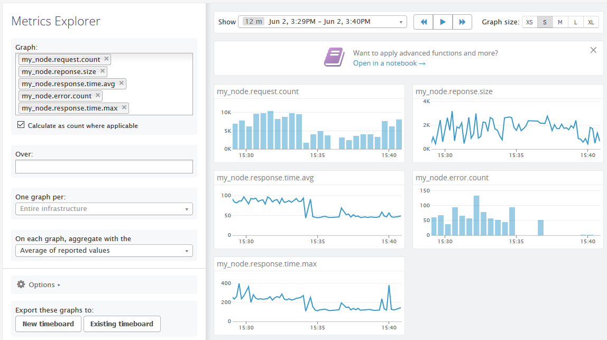

To help illustrate the relationship between various metrics around the saturation point,
we create a custom Dashbaord "My Node Stats".

The `response.time` chart show high load in red, indicating 75ms line between high and low load areas.

The `error.count` chart show high error count area in orange, and mostly no errors in low saturation area.

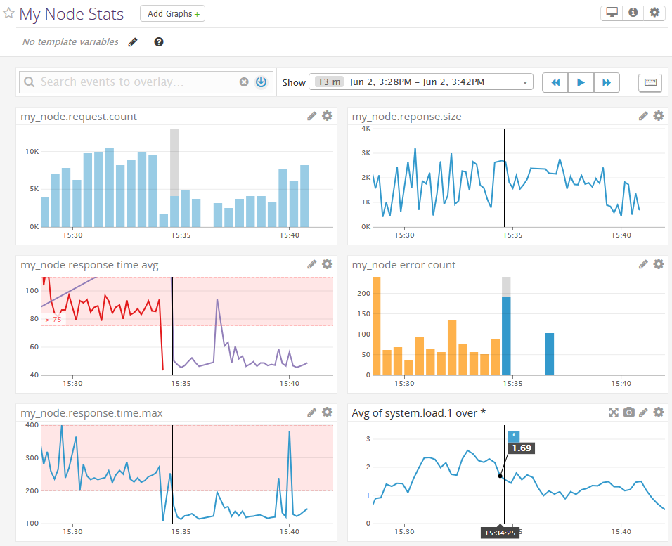

Note: the spikes of errors at the start of each load period indicate warm-up problem
of our configuration after server restart -- a good insight for real life applications.

## Analysis of Pre-Error Metrics

Looking at related metrics, such as requests rate, system load etc, 
in the time before the errors start occurring, would give some
insight into pre-error behavior near the saturation point.

Creating Monitor Warnings, which look into such related metrics,
would allow alerting about potential server overload and allow
taking preventing measures to avoid errors, such as increasing
server resources or improving load balancing.

## Error Events created by Datadog Monitor

It is a good idea to receive a notification that error rate exceeds a certain threashold,
to incidate potential problems and allow responding to the situation.

Datadog has an easy to use interface to create complex monitoring scenarios.
Here we create a monitor for error events when the number of errors exceeds 500.

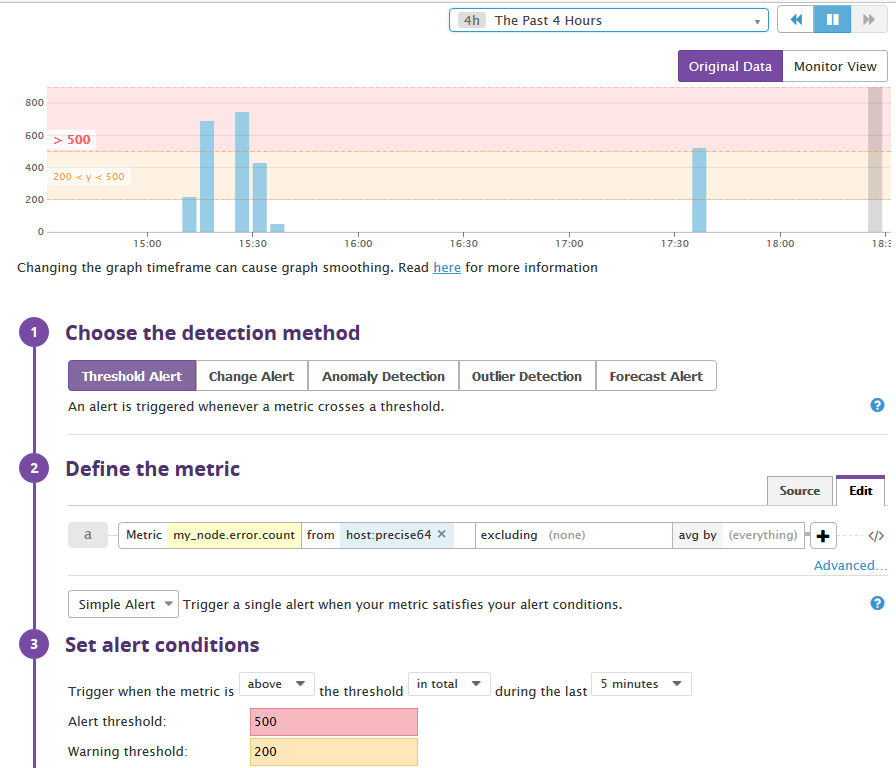

Reulsting Error Events and following automatic resoltution notification appear in the
the Datadog Events area.

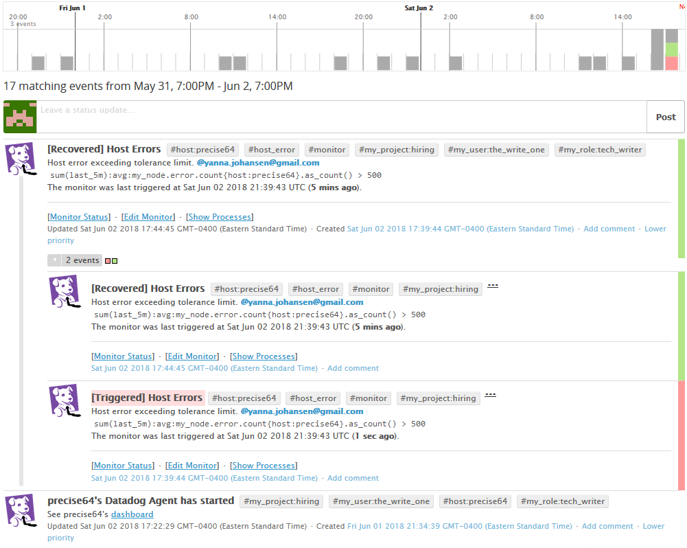

In addition, error events can be investigated to observe related metrics in the vicinity
of the event.

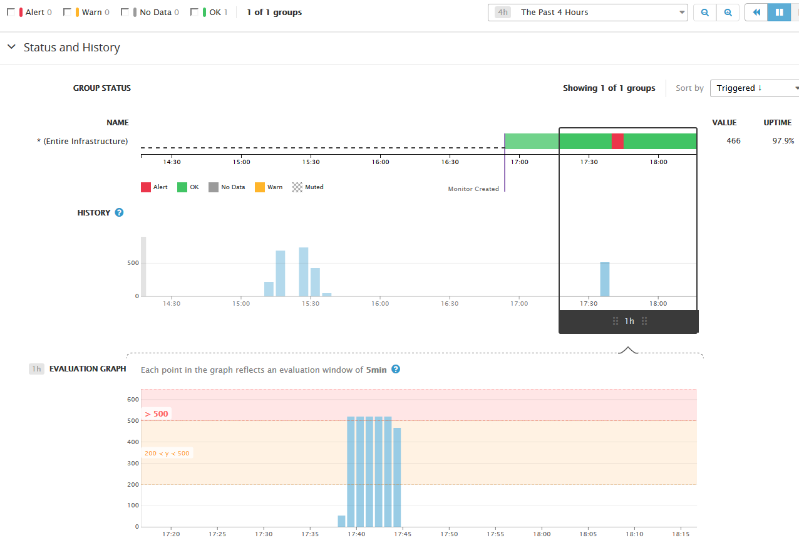


## Acknowledgements

Using Datadog and DogStatsD wouldn't be as easy and productive without
numerous community contributed integrations and libraries created for
virtually any modern cloud computing infrastructure and programming language.

In particular the `hot-stats` module for Node.js was very helpful in seamless
integration of Node.js into Datadog services. Big thanks to the contributors
to the `hot-stats` and `node-statsd` projects!

## References and Further Reading

 * [Collecting Metrics Using StatsD, a Standard for Real-Time Monitoring](https://thenewstack.io/collecting-metrics-using-statsd-a-standard-for-real-time-monitoring/), Technology / Tutorials at The New Stack
 * [Measure Anything, Measure Everything](https://codeascraft.com/2011/02/15/measure-anything-measure-everything/) by Ian Malpass at Code as Craft
 * [How To Configure StatsD to Collect Arbitrary Stats for Graphite on Ubuntu 14.04 ](https://www.digitalocean.com/community/tutorials/how-to-configure-statsd-to-collect-arbitrary-stats-for-graphite-on-ubuntu-14-04) a Digital Ocean tutorial
 * [From Noob To Docker On DigitalOcean With Nginx, Node.js, DataDog Logs, DogStatsD, And LetsEncrypt SSL Certificates ](https://www.bennadel.com/blog/3419-from-noob-to-docker-on-digitalocean-with-nginx-node-js-datadog-logs-dogstatsd-and-letsencrypt-ssl-certificates.htm) by Ben Nadel
 
